# Manual de usuario

## Plataforma de registro y seguimiento de casos sociales

**Version documentada:** 20 de septiembre de 2026  
**Aplicacion:** Casos Sociales / Somos Defensores  
**Desarrollado de forma independiente por:** Simon Torres Saldarriaga  
**Contacto institucional:** proteccion@somosdefensores.org | responsablesistema@somosdefensores.org | comunicaciones@somosdefensores.org  
**Audiencia:** personas solicitantes, equipos de validacion y equipos de revision

Este manual explica como utilizar la version actual de la plataforma. Las capturas se tomaron con el frontend ejecutandose en `http://localhost:3000`; los datos que aparecen en listados administrativos dependen de la conexion con la API y de los permisos del usuario.

## 1. Que permite hacer la plataforma?

La plataforma centraliza el registro y seguimiento de solicitudes sociales. Sus funciones principales son:

- Registrar solicitudes de ayuda humanitaria.
- Registrar solicitudes de pasantia.
- Registrar solicitudes de proteccion colectiva.
- Revisar y gestionar solicitudes desde el area administrativa.
- Consultar metricas y graficos de casos.
- Enviar una invitacion para finalizar un caso y registrar la respuesta de cierre.

## 2. Requisitos de acceso

### Para personas solicitantes

- Navegador web actualizado.
- Conexion a internet o a la red donde este publicada la plataforma.
- Informacion personal, de contacto y del caso.
- Documentos solicitados por el formulario, en el formato y tamano aceptados.

### Para personal administrativo

- Una cuenta habilitada por el administrador.
- Rol de revision o administracion asignado.
- Correo electronico y contrasena validos.

### Para ejecutar el sistema en un entorno local

Se necesitan Node.js, npm, PHP, Composer y una base de datos compatible con Laravel.

Desde la carpeta `backend`:

```bash
composer install
php artisan serve
```

Desde la carpeta `frontend`:

```bash
npm install
npm run dev
```

Direcciones habituales:

- Frontend: `http://localhost:3000`
- Backend: `http://localhost:8000`

El frontend debe tener configurada la variable `NEXT_PUBLIC_API_URL` apuntando al backend. Sin esa configuracion, las consultas y los formularios que envian informacion no podran comunicarse con la API.

## 3. Navegacion publica

### 3.1 Pantalla de inicio

En la pantalla de inicio se muestran las opciones disponibles para registrar un caso: ayuda humanitaria, pasantia y proteccion colectiva.

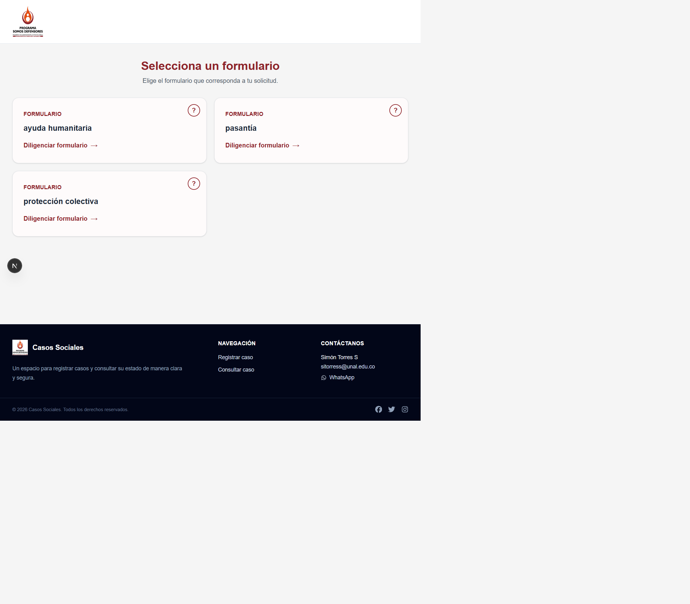

**Como usarla:**

1. Lea el nombre y la descripcion de cada formulario.
2. Seleccione el formulario que corresponda a su situacion.
3. Use la opcion de informacion (`?`) cuando necesite conocer el proposito del formulario.
4. Presione la tarjeta para comenzar el registro.

La seccion inferior permite volver al registro y encontrar los canales de contacto publicados por la organizacion.

### 3.2 Formularios disponibles

La pantalla de seleccion ofrece estas alternativas:

- **Ayuda humanitaria:** registro de una solicitud individual de apoyo.
- **Pasantia:** registro de una solicitud relacionada con el proceso de pasantia.
- **Proteccion colectiva:** registro de una organizacion, colectivo o comunidad que solicita medidas de proteccion.

El formulario de ayuda humanitaria se encuentra organizado por etapas. Las etapas visibles son:

1. Informacion personal.
2. Remision de la solicitud.
3. Informacion del caso.
4. Documentos.

### 3.3 Diligenciar ayuda humanitaria

#### Etapa 1. Informacion personal


En esta etapa se identifica a la persona solicitante y se registra su contexto basico:

- Fecha de ocurrencia del caso.
- Nombres y apellidos.
- Tipo y numero de documento.
- Edad y genero.
- Telefono y correo electronico.
- Grupo etnico, cuando aplique.
- Organizacion a la que pertenece la persona solicitante.
- Condicion de discapacidad y condicion especial de salud.
- Composicion del grupo familiar.
- Lugar de procedencia y lugar de residencia.

Los campos marcados con `*` son obligatorios.

Seleccione primero el departamento para habilitar los municipios de procedencia y residencia. Si la persona tiene hijos o personas que conviven con ella, agregue la informacion solicitada en la seccion familiar.

#### Etapa 2. Remision de la solicitud

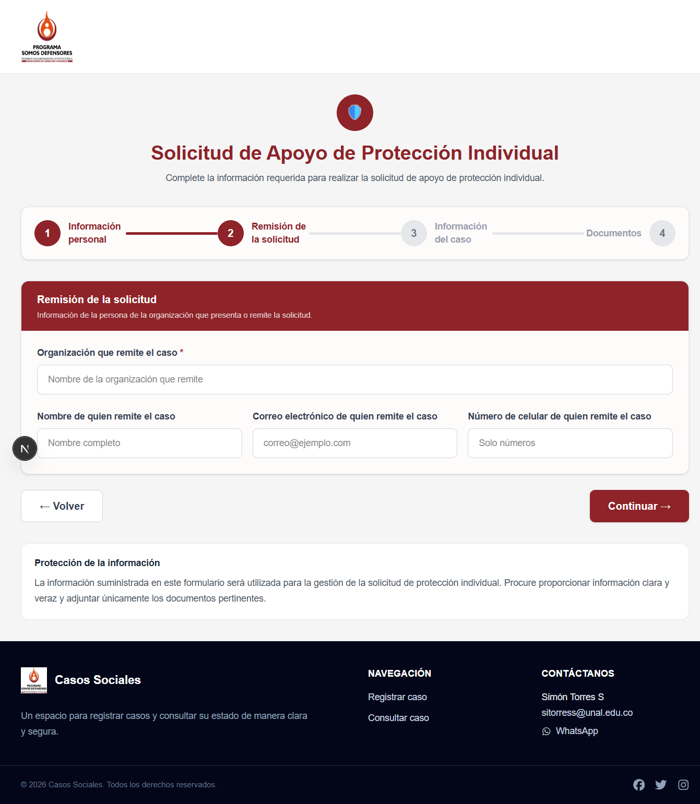

Esta etapa registra la organizacion que presenta o remite el caso. Incluye el nombre de la organizacion y, opcionalmente, los datos de la persona que realiza la remision: nombre, correo y celular.

El campo **Organizacion que remite el caso** es obligatorio. Presione **Continuar** para avanzar.

#### Etapa 3. Informacion del caso

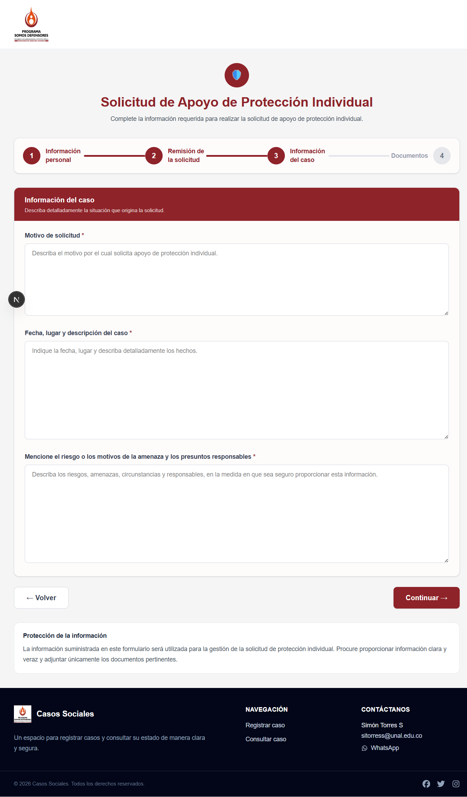

Describa la situacion que origina la solicitud mediante tres campos obligatorios:

- Motivo de solicitud.
- Fecha, lugar y descripcion detallada del caso.
- Riesgo, motivos de la amenaza y presuntos responsables.

Escriba solamente la informacion necesaria para la evaluacion y evite incluir datos que puedan poner a alguien en riesgo.

#### Etapa 4. Documentos adjuntos

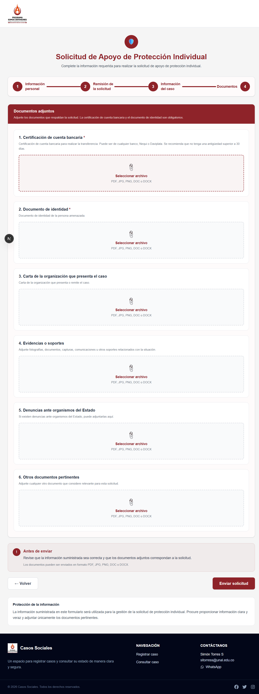

Adjunte los soportes de la solicitud. Son obligatorios la certificacion de cuenta bancaria y el documento de identidad. Tambien puede agregar carta de la organizacion, evidencias, denuncias ante organismos del Estado y otros documentos pertinentes.

La pantalla acepta archivos PDF, JPG, PNG, DOC o DOCX. Revise cada archivo antes de presionar **Enviar solicitud**.

**Procedimiento recomendado para completar las cuatro etapas:**

1. Ingrese la fecha del caso.
2. Escriba los datos exactamente como aparecen en el documento de identidad.
3. Seleccione las opciones de las listas desplegables; no deje la opcion predeterminada si el campo es obligatorio.
4. Use unicamente numeros en los campos que indiquen `Solo numeros`.
5. En los campos de departamento y municipio, seleccione primero el departamento para habilitar los municipios correspondientes.
6. Agregue las personas del grupo familiar con `Agregar persona` cuando sea necesario.
7. Use **Continuar** para avanzar y **Volver** para corregir una etapa anterior.
8. Adjunte los documentos solicitados y revise la informacion antes de enviar.
9. Espere el mensaje de confirmacion. Conserve cualquier numero, codigo o token que entregue el sistema.

**Importante:** no envie informacion de otra persona sin contar con la autorizacion correspondiente. Revise especialmente el numero de identificacion, el correo y el telefono, porque pueden utilizarse para consultar o continuar el caso.

### 3.4 Diligenciar proteccion colectiva

#### Etapa 1. Informacion general del caso

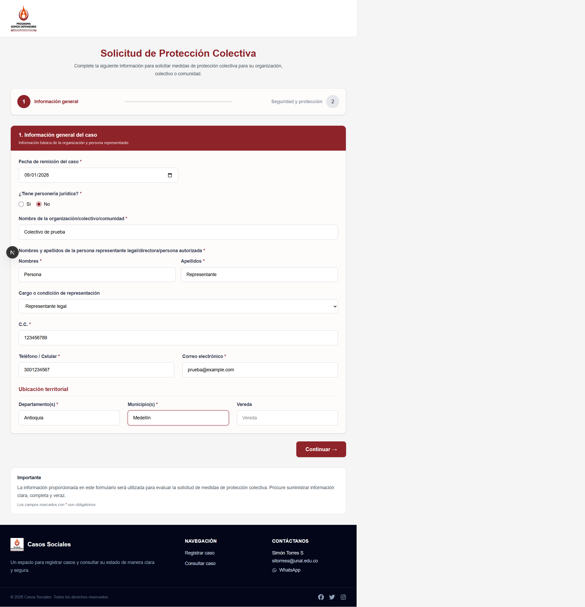

Este formulario esta dirigido a organizaciones, colectivos y comunidades. En esta primera etapa se identifica la organizacion y a la persona que la representa.

En la primera etapa se solicita:

- Fecha de remision del caso.
- Existencia de personeria juridica.
- Nombre de la organizacion, colectivo o comunidad.
- Nombres, apellidos y cargo de la persona representante o autorizada.
- Numero de identificacion, telefono y correo electronico.
- Departamento, municipio y vereda.

**Como completar la etapa:**

1. Diligencie la fecha de remision.
2. Indique si la organizacion tiene personeria juridica.
3. Escriba el nombre completo de la organizacion, colectivo o comunidad.
4. Registre los datos de la persona representante, directora o autorizada.
5. Complete la ubicacion territorial.
6. Presione **Continuar** para pasar a la segunda etapa.

#### Etapa 2. Seguridad y proteccion

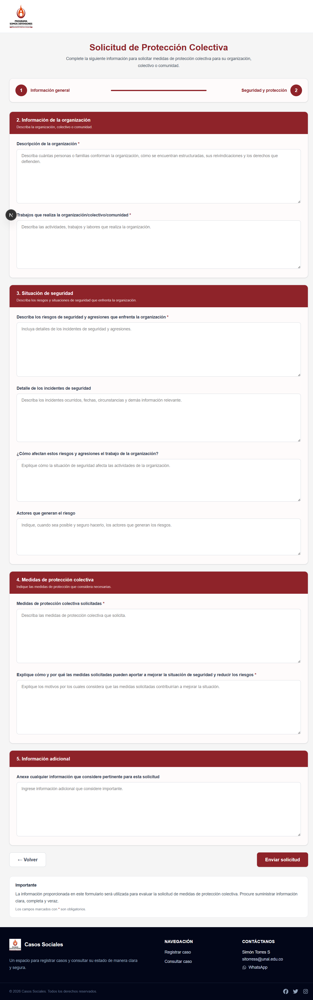

Esta pantalla concentra la descripcion de la organizacion y la situacion de seguridad. Contiene cuatro bloques:

1. **Informacion de la organizacion:** numero de personas o familias, estructura, reivindicaciones y derechos defendidos.
2. **Situacion de seguridad:** riesgos, agresiones, incidentes, afectacion del trabajo y actores que generan el riesgo.
3. **Medidas de proteccion colectiva:** medidas solicitadas y justificacion de como ayudarian a reducir los riesgos.
4. **Informacion adicional:** datos pertinentes que no hayan sido incluidos en los campos anteriores.

Los campos marcados con `*` son obligatorios. Revise que las descripciones sean claras y veraces antes de presionar **Enviar solicitud**.

Los campos marcados con `*` son obligatorios. La informacion debe ser clara, completa y veraz, porque se utiliza para evaluar la solicitud de medidas de proteccion colectiva.

### 3.5 Diligenciar pasantia

#### Etapa 1. Informacion personal

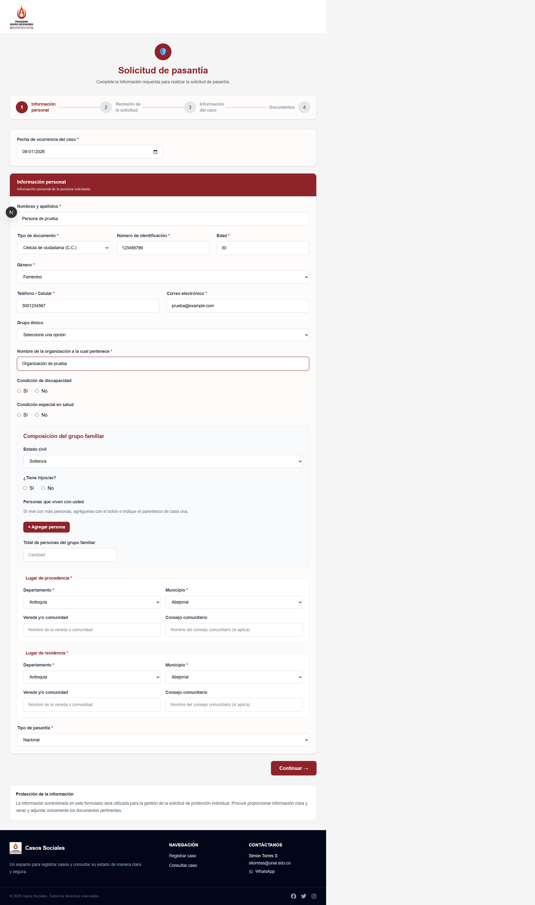

El formulario de pasantia utiliza las etapas **Informacion personal**, **Remision de la solicitud**, **Informacion del caso** y **Documentos**. En esta primera etapa se registra la informacion de la persona y el tipo de pasantia.

En la primera etapa se solicita:

- Fecha de ocurrencia del caso.
- Nombres y apellidos.
- Tipo y numero de documento.
- Edad y genero.
- Telefono y correo electronico.
- Grupo etnico, cuando aplique.
- Organizacion a la que pertenece la persona solicitante.
- Condiciones de discapacidad y salud.
- Composicion del grupo familiar.
- Lugar de procedencia y lugar de residencia.
- Tipo de pasantia.

Los campos marcados con `*` son obligatorios.

#### Etapa 2. Remision de la solicitud

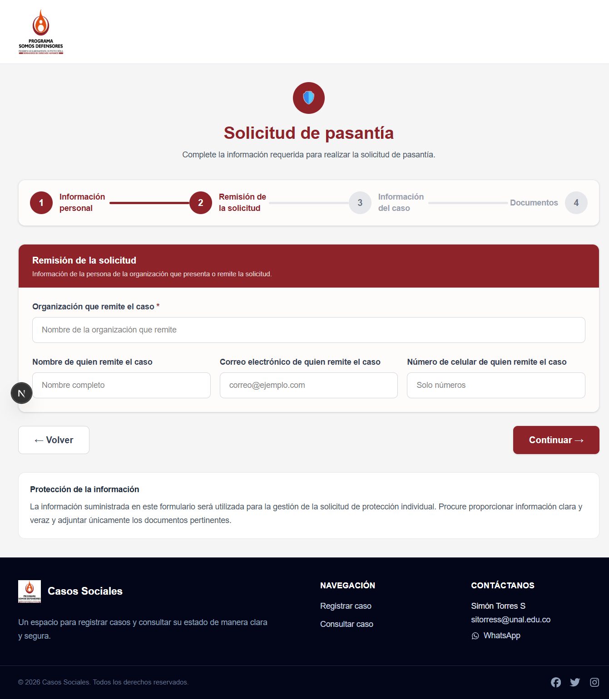

Registre la organizacion que remite el caso y, si corresponde, el nombre, correo electronico y celular de la persona que realiza la remision. La organizacion remitente es obligatoria.

#### Etapa 3. Informacion del caso

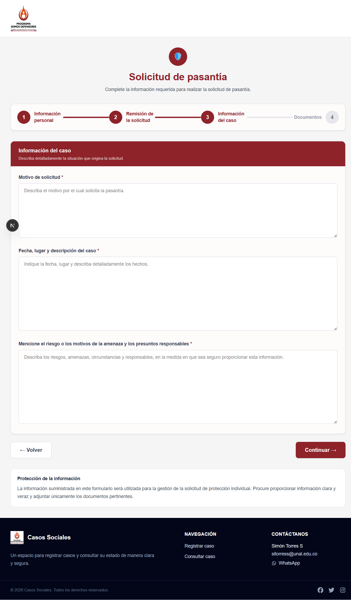

Explique el motivo por el cual solicita la pasantia, la fecha, el lugar y la descripcion de los hechos, junto con los riesgos o circunstancias relevantes. Los tres campos de esta etapa son obligatorios.

#### Etapa 4. Documentos adjuntos

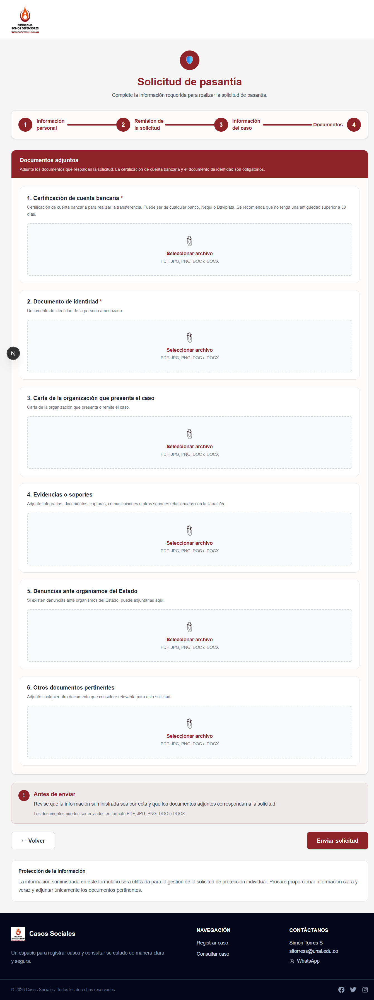

Adjunte la certificacion de cuenta bancaria y el documento de identidad, que son obligatorios. Puede agregar carta de la organizacion, evidencias, denuncias y otros documentos pertinentes.

**Procedimiento:**

1. Complete la fecha y la informacion personal.
2. Seleccione el tipo de documento, genero y demas opciones de las listas.
3. Agregue las personas del grupo familiar cuando sea necesario.
4. Seleccione primero el departamento para cargar los municipios disponibles y seleccione el tipo de pasantia.
5. Complete la remision, la informacion especifica del caso y los documentos.
6. Revise los datos y envie la solicitud.

La plataforma utiliza la misma estructura de captura de informacion personal que ayuda humanitaria, pero el caso queda clasificado como pasantia.

Si una opcion del formulario no esta disponible o la pantalla muestra un error, registre la incidencia con la fecha, la ruta visitada y el mensaje mostrado. No vuelva a enviar varias veces la misma solicitud sin confirmar primero si el registro fue creado.

### 3.6 Fuente publica de datos

La ruta `/reportes` presenta la **Fuente publica de datos**. Esta seccion contiene reportes de demostracion mientras se habilita la publicacion de los informes oficiales.

Actualmente se muestran:

- **Distribucion territorial de casos:** enlaza al visor geografico.
- **Tendencias mensuales:** tarjeta de demostracion, disponible proximamente.
- **Caracterizacion de casos:** tarjeta de demostracion, disponible proximamente.

Las tarjetas marcadas como **Demo** no deben interpretarse como estadisticas oficiales. Cuando se publique un reporte, revise su fecha de actualizacion, cobertura y notas metodologicas antes de utilizarlo.

### 3.7 Reporte geografico de casos

La ruta `/geografia-publica` ofrece un visor de mapas alimentado por la API publica y las geometrias almacenadas en PostGIS.

**Seleccionar una vista:**

1. Elija **Departamentos** para consultar la division territorial nacional.
2. Elija **Municipios** para mostrar todos los municipios disponibles.
3. Elija **Por departamento** y seleccione un departamento en la lista para consultar sus municipios.

En la vista de departamentos puede hacer clic sobre cualquier departamento. El visor cambia automaticamente a la vista de sus municipios. El nombre del territorio bajo el cursor aparece en la esquina superior derecha del mapa.

Al seleccionar un municipio se abre un modal con su nombre, departamento y un resumen de prueba. Ese resumen es provisional y sera reemplazado por informacion estadistica publica cuando el modulo de reportes este disponible.

**Descargas del visor:**

- **PDF:** se habilita al seleccionar un departamento o municipio y descarga un resumen territorial de prueba.
- **CSV:** aparece como control reservado para una futura descarga y no ejecuta ninguna accion por ahora.

Si el mapa no carga, compruebe que el backend este disponible, que `NEXT_PUBLIC_API_URL` apunte a la API correcta y que las tablas geograficas hayan sido migradas.

### 3.8 Pie de pagina, contacto y politicas

El pie de pagina identifica a Somos Defensores, contiene los enlaces oficiales de Facebook, Instagram y X, y presenta el contacto institucional:

- **Direccion:** Transversal 26B # 40A-86, barrio La Soledad, Bogota D.C. - Colombia.
- **Telefonos:** (057 1) 2814010 - 2813048.
- **Correos:** proteccion@somosdefensores.org, responsablesistema@somosdefensores.org y comunicaciones@somosdefensores.org.

La seccion **Politicas institucionales** enlaza a `/politicas` y contiene los apartados de privacidad, tratamiento de datos personales y terminos de uso. Los textos visibles actualmente indican cuando un documento se encuentra en actualizacion.

La atribucion de desarrollo independiente aparece de forma discreta al final del pie de pagina. Simon Torres Saldarriaga no hace parte de Somos Defensores.

## 4. Acceso administrativo

### 4.1 Inicio de sesion

La pantalla administrativa esta disponible en `/login`.

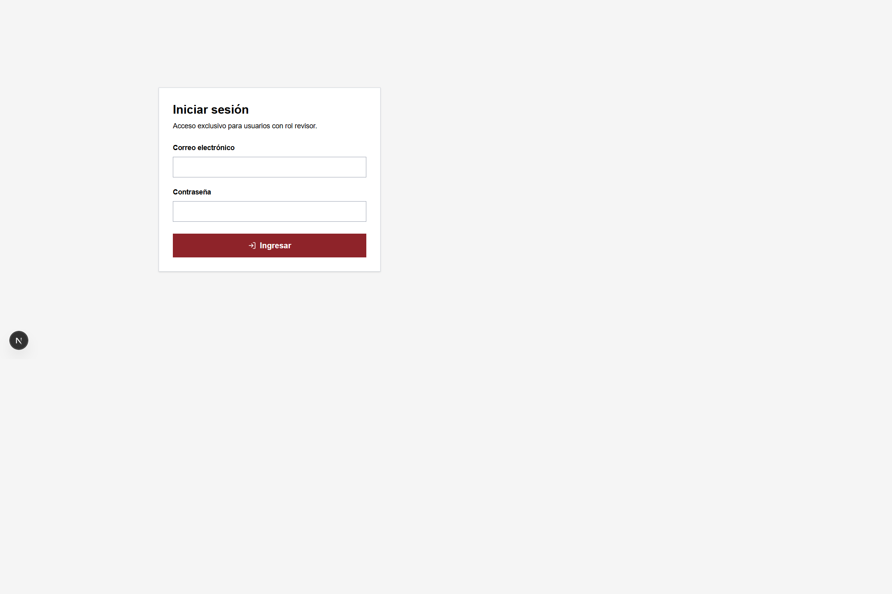

**Pasos:**

1. Escriba el correo electronico de la cuenta autorizada.
2. Escriba la contrasena.
3. Presione **Ingresar**.
4. Espere la redireccion al dashboard.

El acceso esta restringido a usuarios con rol de revision o administracion. No comparta la contrasena ni guarde el token de acceso fuera del navegador autorizado.

Si el inicio de sesion falla, revise el mensaje mostrado, confirme que el correo este escrito correctamente y compruebe que el backend este disponible. El dashboard redirige a esta pantalla cuando no existe una sesion valida.

### 4.2 Dashboard

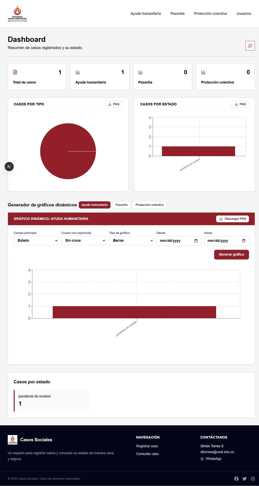

El dashboard administrativo presenta:

- Total de casos.
- Total por tipo de caso.
- Distribucion por estado.
- Grafico de casos por tipo.
- Grafico de casos por estado.
- Grafico dinamico por ayuda humanitaria, pasantia o proteccion colectiva.
- Boton para actualizar las metricas.

**Como leer y utilizar el dashboard:**

1. Revise la tarjeta **Total de casos** para conocer el volumen general.
2. Compare las tarjetas por tipo: ayuda humanitaria, pasantia y proteccion colectiva.
3. Consulte el grafico de casos por tipo para identificar la distribucion de solicitudes.
4. Consulte el grafico de casos por estado para observar pendientes, aprobados, finalizados u otros estados disponibles.
5. En **Generador de graficos dinamicos**, seleccione el tipo de caso y el campo principal.
6. Use **Cruzar con** para comparar dos variables, seleccione barras o torta y defina un rango de fechas si es necesario.
7. Presione **Generar grafico** y use **Descargar PNG** para guardar el resultado.
8. Use **Actualizar metricas** despues de registrar o modificar varios casos.

Si no existen registros o la API no responde, el sistema muestra un mensaje y no debe interpretarse como que se eliminaron casos.

### 4.3 Usuarios

La seccion de usuarios esta disponible en `/admin/usuarios` y permite gestionar el equipo de validacion y revision.

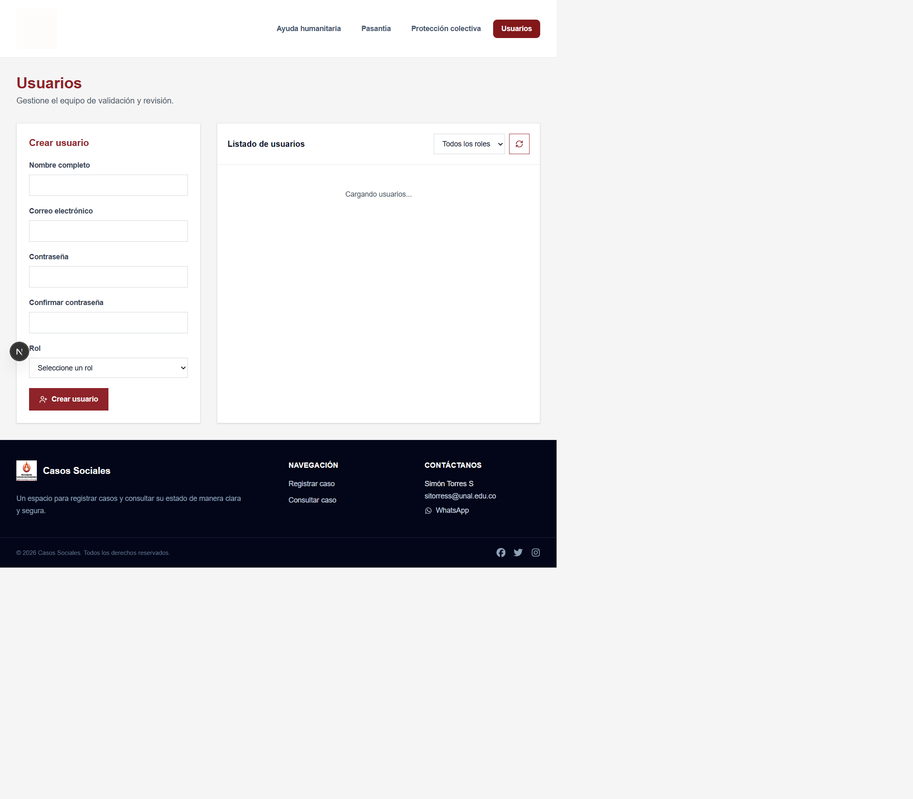

La pantalla se divide en dos areas:

- **Crear usuario:** formulario para registrar nombre completo, correo, contrasena, confirmacion de contrasena y rol.
- **Listado de usuarios:** tabla con nombre, correo, rol y acciones disponibles.

**Crear una cuenta:**

1. Escriba el nombre completo.
2. Registre un correo valido y que pertenezca a la persona autorizada.
3. Defina una contrasena de al menos ocho caracteres.
4. Repita la contrasena exactamente en el campo de confirmacion.
5. Seleccione el rol **Validador** o **Revisor**.
6. Presione **Crear usuario**.
7. Confirme el mensaje de creacion exitosa.

**Filtrar y actualizar el listado:**

1. Abra el selector **Todos los roles**.
2. Seleccione **Validador** o **Revisor** para limitar los resultados.
3. Presione **Actualizar listado** para consultar nuevamente la API.

**Cambiar una contrasena:**

1. Ubique la cuenta en el listado.
2. Presione **Cambiar contraseña**.
3. Escriba y confirme la nueva contrasena.
4. Verifique el mensaje de confirmacion.

**Eliminar una cuenta:**

1. Confirme que la cuenta seleccionada sea la correcta.
2. Presione **Eliminar usuario**.
3. Revise el aviso de confirmacion antes de aceptar.
4. Actualice el listado y confirme que la cuenta ya no aparece.

La administracion de usuarios es una funcion sensible. No cree cuentas compartidas, no reutilice contrasenas y no elimine la unica cuenta con rol de revisor. Las contrasenas nunca deben registrarse en este manual ni compartirse por canales publicos.

### 4.4 Listados de casos

Los listados administrativos se consultan por tipo:

- `/admin/ayuda_humanitaria`
- `/admin/pasantias`
- `/admin/proteccion_colectiva`

Segun el modulo, se puede:

- Buscar por nombre, organizacion, documento, representante o correo.
- Filtrar por estado.
- Filtrar por pago y rango de fechas en ayudas humanitarias.
- Actualizar los datos desde el backend.
- Exportar los registros a CSV.
- Abrir la gestion detallada de un caso.
- Enviar la invitacion de finalizacion del caso.

En ayudas humanitarias, la pantalla resume total de solicitudes, pendientes, aprobadas y rechazadas. En proteccion colectiva resume total, pendientes y resultados filtrados.

### 4.5 Gestion de un caso

Desde la fila del caso, abra la opcion de gestionar. Revise los datos personales o de la organizacion, la informacion de contacto, el estado actual y la informacion del caso antes de modificarlo.

Al cambiar un estado:

1. Verifique que esta trabajando sobre el caso correcto.
2. Lea toda la informacion disponible.
3. Seleccione el nuevo estado permitido para su rol.
4. Guarde el cambio.
5. Actualice el listado y confirme que el estado se refleja correctamente.

Los estados pueden incluir `pendiente`, `en revision`, `validado`, `rechazado`, `aprobado`, `en proceso de cierre`, `desembolsado` y `finalizado`, de acuerdo con el flujo habilitado en el backend.

### 4.6 Finalizar un caso

Desde el listado administrativo, use la accion de finalizacion del caso. El sistema genera un enlace unico y lo envia al correo asociado al registro.

La persona destinataria abre el enlace recibido y debe:

1. Leer la informacion de cierre.
2. Escribir una respuesta en el campo de finalizacion.
3. Presionar **Finalizar caso**.
4. Confirmar el mensaje de registro exitoso.

El enlace tiene una vigencia de siete dias y solo puede utilizarse una vez. Una vez registrada la respuesta, el caso pasa a estado `finalizado` y el enlace deja de ser valido.

## 5. Gestion completa de un caso

El flujo administrativo se recorre desde el listado del tipo de caso. Para la prueba incluida en el seeder, el registro aparece como **Caso de prueba Manual**, con identificacion `PRUEBA-MANUAL-001` y estado `pendiente de revisión`. Este registro es ficticio y sirve para practicar sin usar datos de una persona real.

Para cargar este caso en un entorno local de pruebas, ejecute desde `backend`:

```bash
php artisan db:seed --class=DatabaseSeeder
```

No ejecute este comando en produccion sin revisar antes los datos que el seeder agrega o actualiza.

### 5.1 Ver el caso por secciones

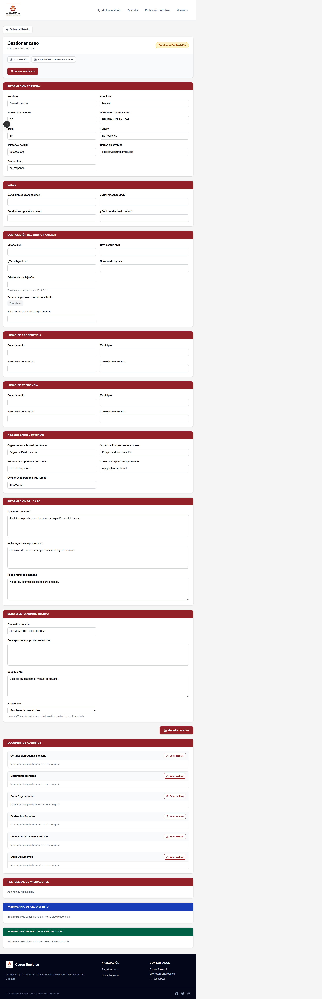

Desde el listado, presione **Gestionar** en la fila del caso. La pantalla organiza la informacion en bloques para facilitar la lectura:

- **Informacion personal:** nombres, documento, edad, genero, telefono, correo y grupo etnico.
- **Salud:** discapacidad y condiciones especiales de salud.
- **Composicion del grupo familiar:** estado civil, hijos, edades, personas convivientes y total del grupo.
- **Lugar de procedencia:** departamento, municipio, vereda o consejo comunitario.
- **Lugar de residencia:** departamento, municipio, vereda o consejo comunitario.
- **Organizacion y remision:** organizacion, persona remitente, correo, celular y tipo de pasantia cuando corresponda.
- **Informacion del caso:** motivo de solicitud, fecha, lugar, descripcion, riesgos y amenazas.
- **Seguimiento administrativo:** fecha de remision, concepto, seguimiento y datos de pago.
- **Documentos adjuntos:** archivos recibidos, categorias disponibles, reemplazo, carga adicional y descarga ZIP.
- **Respuestas de validadores:** historial de decisiones, comentarios y respuestas del equipo revisor.
- **Formulario de seguimiento:** respuesta posterior al apoyo o desembolso.
- **Formulario de finalizacion:** respuesta de cierre y estado del enlace.

Use **Exportar PDF** para generar un resumen del caso o **Exportar PDF con conversaciones** para incluir las respuestas de validacion. No descargue estos archivos en equipos compartidos sin autorizacion.

### 5.2 Gestionar y guardar cambios

1. Abra el caso desde el listado correspondiente.
2. Revise cada seccion antes de modificar datos.
3. Corrija o complete los campos permitidos.
4. Agregue documentos faltantes desde **Documentos adjuntos** o use **Resubir** para reemplazar un archivo.
5. Presione **Guardar cambios**.
6. Confirme el mensaje de actualizacion y revise que los datos permanezcan correctos.

Los campos de identificacion interna, token, estado, fechas de auditoria y documentos protegidos no se editan directamente. Un caso aprobado o rechazado solo permite modificar el seguimiento y los documentos autorizados por el backend. Un caso finalizado no puede modificarse.

### 5.3 Validacion de caso

La validacion se inicia únicamente cuando el caso esta en `pendiente de revisión`.

1. Abra el caso y revise la informacion y los documentos.
2. Presione **Iniciar validación**.
3. El sistema cambia el caso a `en proceso de validación`.
4. Se generan invitaciones para hasta cinco usuarios con rol `validador`.
5. Cada validador abre su enlace, revisa las secciones y documentos, y selecciona una decision.
6. La decision puede ser **Aprobar caso**, **Rechazar caso** o **Solicitar aclaración**.
7. Si se solicita aclaracion, el comentario que indica que debe aclararse es obligatorio.
8. El equipo revisor puede responder dentro del hilo de validacion.

La decision automatica requiere consenso: si todos los validadores responden aprobado, el caso pasa a `aprobado`; si todos responden rechazado, pasa a `rechazado`; si existen respuestas diferentes o aclaraciones, permanece en `en proceso de validación` hasta que el equipo resuelva la diferencia. Un enlace de validacion respondido, expirado o reutilizado deja de estar disponible.

### 5.4 Desembolso

El desembolso se gestiona desde **Seguimiento administrativo**.

Para ayuda humanitaria:

1. El caso debe estar en estado `aprobado`.
2. En **Pago único**, seleccione `Pendiente de desembolso` o `Esperando desembolso` según el estado interno.
3. Cuando el pago se haya realizado, seleccione `Desembolsado`.
4. Confirme el mensaje de actualizacion.

El backend no permite marcar como desembolsado un caso que no este aprobado. Para pasantias, el seguimiento de pagos se maneja por `Primer pago`, `Segundo pago` y `Tercer pago`; actualice cada uno con el estado que corresponda.

### 5.5 Formulario de seguimiento

El formulario de seguimiento se habilita para un caso aprobado. En ayuda humanitaria, además, el pago debe estar marcado como `desembolsado`.

1. Presione **Formulario de seguimiento** para enviarlo por correo, o **Copiar link del formulario de seguimiento** para compartir el enlace manualmente.
2. El destinatario abre el enlace temporal `/seguimiento/{token}`.
3. Debe describir su situacion actual; este campo es obligatorio.
4. Puede indicar si recibio el apoyo o desembolso: si, parcialmente o no.
5. Si la respuesta es parcial o negativa, explique la situacion del apoyo.
6. Seleccione si la seguridad mejoro, permanece igual o empeoro.
7. Agregue comentarios adicionales si es necesario.
8. Presione **Enviar seguimiento**.

El enlace vence en siete dias y solo puede utilizarse una vez. La respuesta queda visible en la seccion **Formulario de seguimiento** del caso.

### 5.6 Formulario de finalizacion

La finalizacion solo se habilita despues de que el formulario de seguimiento haya sido respondido y el caso permanezca aprobado.

1. Desde el caso, presione **Finalizar caso** para enviar la invitacion, o **Copiar link para finalizar caso** para compartirla manualmente.
2. El destinatario abre `/finalizacion/{token}`.
3. El enlace valida que el caso siga aprobado, que no haya expirado y que no se haya usado.
4. La persona escribe una respuesta de finalizacion de hasta 5000 caracteres.
5. Presiona **Finalizar caso**.
6. El sistema registra la respuesta, invalida los enlaces pendientes y cambia el estado a `finalizado`.

Un caso finalizado queda bloqueado para modificaciones posteriores. Si el enlace es invalido, ya fue utilizado o expiro, el equipo revisor debe generar una nueva invitacion cuando el flujo lo permita.

## 6. Roles y permisos

- **Administrador:** gestiona usuarios, casos, metricas y configuraciones autorizadas.
- **Equipo de validacion de casos:** revisa la informacion y valida solicitudes segun sus permisos.
- **Equipo de revision de casos:** hace seguimiento, actualiza estados y puede iniciar el proceso de finalizacion.

El backend aplica autenticacion por token y middleware de roles. La interfaz visible no sustituye las restricciones del servidor: una accion solo debe considerarse exitosa cuando la API confirma el resultado.

## 7. Mensajes y solucion de problemas

### La pagina no carga

1. Compruebe que el frontend este ejecutandose.
2. Compruebe que la URL y el puerto sean correctos.
3. Revise la consola del navegador y los registros del backend.
4. Recargue la pagina despues de confirmar que ambos servicios estan activos.

### No se muestran casos administrativos

1. Confirme que inicio sesion con un usuario autorizado.
2. Presione **Actualizar**.
3. Revise si hay filtros activos y use la opcion para limpiarlos.
4. Compruebe que el backend responda y que la base de datos tenga registros.

### No se puede enviar un formulario

1. Revise los campos obligatorios.
2. Compruebe los formatos de correo, telefono, fechas y documentos.
3. Verifique que los archivos cumplan las restricciones del formulario.
4. Evite recargar o enviar varias veces hasta confirmar el resultado.

### El enlace de finalizacion no funciona

El enlace puede haber expirado, haber sido utilizado o estar incompleto. Solicite una nueva invitacion al equipo de revision. No reutilice enlaces recibidos anteriormente.

## 8. Seguridad y proteccion de datos

- Use unicamente los datos necesarios para atender el caso.
- No envie numeros de identificacion, documentos o tokens por canales publicos.
- Cierre la sesion al terminar una jornada de revision.
- No comparta cuentas administrativas.
- Verifique destinatarios antes de enviar una invitacion de finalizacion.
- No descargue o exporte listados en equipos compartidos sin autorizacion.

## 9. Alcance y limitaciones observadas

Este documento refleja la version capturada el 7 de septiembre de 2026. La disponibilidad de listados, metricas, cambios de estado y envios depende de la API, la base de datos y el rol autenticado.

Algunas rutas y formularios pueden estar en proceso de integracion. Los reportes de la fuente publica, el resumen del modal municipal y la descarga PDF del visor son demostraciones y no representan datos oficiales hasta que se publique la informacion correspondiente. Si un enlace de navegacion lleva a una ruta distinta de la documentada, use la ruta visible en la barra del navegador y reportela al equipo de soporte para actualizar este manual.

## 10. Soporte y reporte de incidentes

Para reportar un problema, incluya:

- Fecha y hora.
- Usuario o rol, sin incluir la contrasena.
- Ruta visitada.
- Accion realizada.
- Mensaje exacto mostrado.
- Captura sin datos personales visibles.

El pie de pagina de la aplicacion muestra los canales de contacto disponibles para la organizacion.

Para asuntos institucionales o sobre el funcionamiento de la plataforma, contacte a los canales oficiales:

- **Proteccion:** proteccion@somosdefensores.org
- **Sistemas:** responsablesistema@somosdefensores.org
- **Comunicaciones:** comunicaciones@somosdefensores.org
- **Direccion:** Transversal 26B # 40A-86, barrio La Soledad, Bogota D.C. - Colombia
- **Telefonos:** (057 1) 2814010 - 2813048

El software fue desarrollado de forma independiente por **Simon Torres Saldarriaga**. Su contacto tecnico es `sitorress@unal.edu.co`; no hace parte de Somos Defensores.

## 11. Glosario

- **Caso:** registro de una solicitud en la plataforma.
- **Estado:** etapa actual del caso.
- **Token:** credencial temporal usada para autenticar una sesion o un enlace.
- **API:** servicio del backend que recibe y entrega la informacion.
- **Rol:** conjunto de permisos asignados a una cuenta.
- **CSV:** archivo de texto que permite exportar registros tabulares.
- **Finalizacion:** registro de la respuesta de cierre que cambia el caso a `finalizado`.
- **FeatureCollection:** formato GeoJSON que agrupa entidades geograficas como departamentos o municipios.
- **PostGIS:** extension espacial de PostgreSQL utilizada para almacenar y consultar las geometrias de Colombia.
- **Visor geografico:** pantalla publica que representa departamentos y municipios, permite seleccionar territorios y prepara descargas.

## 12. Control de cambios del manual

Actualice este documento cuando se agregue o retire un formulario, cambien los estados, se modifiquen los roles, cambien las rutas publicas y administrativas o se habiliten reportes oficiales. Las capturas deben renovarse cuando la interfaz cambie de forma visible.

## 13. Rutas publicas de mapas para administracion tecnica

Estas rutas no requieren autenticacion y devuelven una respuesta `FeatureCollection` en formato GeoJSON:

```text
GET /api/publico/mapas/departamentos
GET /api/publico/mapas/municipios
GET /api/publico/mapas/departamentos/{departamento}/municipios
```

La primera devuelve los departamentos, la segunda devuelve todos los municipios y la tercera filtra los municipios por el nombre o identificador almacenado del departamento.

Las geometrias se importan desde `backend/storage/app/private/colombia-geojson.json`. Aunque el archivo tiene extension `.json`, su contenido es TopoJSON y contiene las capas `depts` y `mpios`. Las migraciones PostGIS crean las tablas `departamentos_geometrias` y `municipios_geometrias`, con SRID 4326 e indices espaciales GIST.

Para preparar una base local con las geometrias, ejecute desde `backend`:

```bash
php artisan migrate
```

La base de datos debe ser PostgreSQL con la extension PostGIS habilitada. No exponga el archivo privado ni modifique sus datos directamente en produccion sin un respaldo y una migracion controlada.
